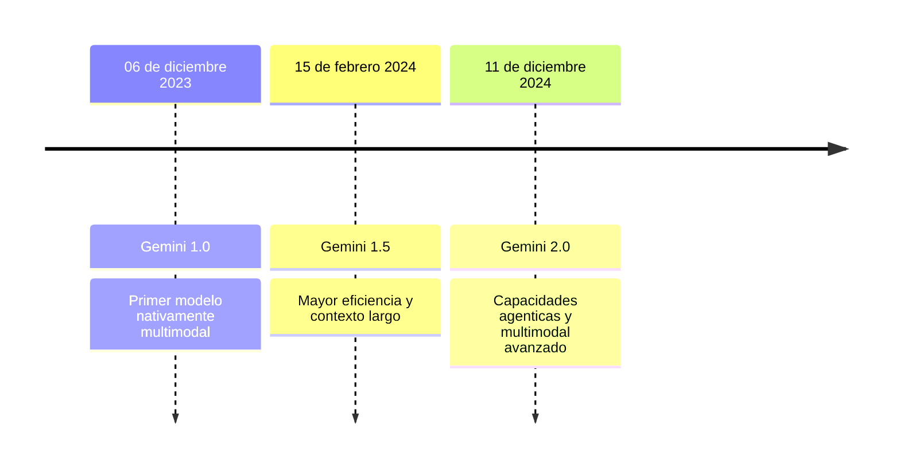

# :LiBrainCircuit: Gemini

> [!question]+  **¿Qué es?**
> Es una familia de grandes modelos de lenguaje (LLM) **multimodales**. Fue desarrollada por _Google_ para ser una plataforma central de Inteligencia Artificial (IA) en todo su ecosistema de productos.

> [!info]- **Más información**
> A diferencia de los LLM tradicionales, Gemini está diseñado con una arquitectura multimodal desde su creación, esto significa que puede comprender y generar no solo texto, sino también imágenes, audio, video y código. Esta capacidad de integrar información de diversas modalidades le permite a Gemini abordar tareas complejas y ofrecer soluciones más completas y creativas, lo que lo convierte en una herramienta poderosa con un gran potencial en diversos campos.

## :LiStarList: Características principales

- multi! **Multimodalidad**: Puede entender y generar respuestas combinando diferentes tipos de entrada y salida, lo que lo hace ideal para tareas complejas que integran **múltiples formatos de datos**.

- esca! **Escalabilidad**: Disponible en diferentes tamaños (Ultra, Pro, Nano, Flash, etc.) para adaptarse a diversos contextos, desde dispositivos móviles hasta centros de datos.

- tok! **Ventana de contexto larga**: La mayoría de modelos Gemini soportan límites de tokens de entrada **superiores al millón**, significativamente mayor que los 128,000 tokens de ChatGPT.

- tog! **Integración**: Se integra fácilmente con otras aplicaciones y servicios, especialmente dentro del ecosistema de Google, potenciando la colaboración entre diversas plataformas.

## :FasCubes: Modelos
### :FasTimeline: Generaciones

Existen tres generaciones principales de la familia Gemini:



### :LiVariable: Variaciones

Para los distintos modelos de la familia Gemini, existen variaciones que indican ciertas características de su funcionamiento:

| **Modelo**       | **Enfoque**                                                                        | **Ventajas**                                   | **Ideal para**                                                                                                     |
| ---------------- | ---------------------------------------------------------------------------------- | ---------------------------------------------- | ------------------------------------------------------------------------------------------------------------------ |
| **Nano**         | Diseñado para dispositivos con **recursos limitados** (ej. móviles)                | Eficiencia energética y velocidad de respuesta | Tareas básicas de lenguaje natural en móviles (traducción rápida, respuestas sencillas, generación de texto corto) |
| **Pro**          | Modelo de **propósito general** para una amplia gama de tareas de lenguaje natural | Equilibrio entre rendimiento y eficiencia      | Chatbots, resumen de textos, análisis de sentimientos, creación de contenido más extenso                           |
| **Ultra**        | La versión **más potente** y capaz de Gemini                                       | Rendimiento superior en tareas complejas       | Traducción de alta calidad, generación de código, análisis de textos extensos, tareas de investigación             |
| **Flash**        | Optimizado para **velocidad y eficiencia**                                         | Respuesta rápida y bajo consumo de recursos    | Aplicaciones en tiempo real (asistentes virtuales, chatbots de respuesta instantánea)                              |
| **Thinking**     | Diseñado para procesamiento profundo y comprensión contextual (**razonamiento**)   | Mayor capacidad de razonamiento y análisis     | Comprensión de textos largos y complejos, generación creativa de contenido, resolución de problemas complejos      |
| **Experimental** | Para probar **nuevas funciones** y capacidades de Gemini                           | Acceso a innovaciones en IA                    | Experimentación y retroalimentación sobre nuevas funciones; puede tener errores o funcionalidades incompletas      |

> [!diagram]- Diagrama: **Versiones de Gemini**
> ```mermaid
> flowchart TD
>     Gemini_Nano("Gemini Nano")
>     Detalle_Nano["Enfoque: Dispositivos con recursos limitados<br> Ventajas: Eficiencia energética y velocidad<br> Ideal para: Traducción rápida, respuestas sencillas, texto corto"]
>     
>     Gemini_Pro("Gemini Pro")
>     Detalle_Pro["Enfoque: Propósito general<br> Ventajas: Equilibrio rendimiento-eficiencia<br> Ideal para: Chatbots, resumen de textos, análisis de sentimientos"]
>     
>     Gemini_Ultra("Gemini Ultra")
>     Detalle_Ultra["Enfoque: Mayor potencia<br> Ventajas: Rendimiento superior<br> Ideal para: Traducción de alta calidad, generación de código, investigación"]
>     
>     Gemini_Flash("Gemini Flash")
>     Detalle_Flash["Enfoque: Velocidad y eficiencia<br> Ventajas: Respuesta rápida<br> Ideal para: Asistentes virtuales en tiempo real"]
>     
>     Gemini_Thinking("Gemini Thinking")
>     Detalle_Thinking["Enfoque: Procesamiento profundo y comprensión<br> Ventajas: Razonamiento avanzado<br> Ideal para: Comprensión de textos largos, creatividad, análisis complejo"]
>     
>     Gemini_Experimental("Gemini Experimental")
>     Detalle_Experimental["Enfoque: Pruebas de nuevas funciones<br> Ventajas: Innovación continua<br> Consideraciones: Menos estable, retroalimentación de usuarios"]
> 
>     Gemini_Nano --> Detalle_Nano
>     Gemini_Pro --> Detalle_Pro
>     Gemini_Ultra --> Detalle_Ultra
>     Gemini_Flash --> Detalle_Flash
>     Gemini_Thinking --> Detalle_Thinking
>     Gemini_Experimental --> Detalle_Experimental
> ```


### :LiPanelTopClose: Principales

| Modelo                        | Tokens de Entrada | Uso Principal                                              | Más Afín Para                                                                                                                                                                                                        | Menos Afín Para                                                                                                     |
| ----------------------------- | ----------------- | ---------------------------------------------------------- | -------------------------------------------------------------------------------------------------------------------------------------------------------------------------------------------------------------------- | ------------------------------------------------------------------------------------------------------------------- |
| **Gemini 2.0 Flash**          | 1,048,576         | Trabajo diario con rendimiento sólido y API en tiempo real | - Baja latencia y respuestas rápidas <br> - Procesamiento de entradas multimodales <br> - Generación de texto, código, extracción y edición de texto <br> - Uso de herramientas nativas <br> - Generación multimodal | - Razonamiento profundo o análisis complejo (mejor con Pro o Flash Thinking)                                        |
| **Gemini 2.0 Flash-Lite**     | 1,048,576         | Eficiencia de costos y baja latencia                       | - Casos de uso con preocupación de costos <br> - Volumen alto de consultas <br> - Respuestas rápidas y eficientes                                                                                                    | - Generación multimodal <br> - API Multimodal Live <br> - Modo de pensamiento <br> - Uso de herramientas integradas |
| **Gemini 2.0 Pro**            | 2,097,152         | Codificación avanzada y conocimiento del mundo             | - Codificación y conocimiento profundo <br> - Prompts complejos con razonamiento avanzado <br> - Contexto largo (análisis de documentos extensos, bases de conocimiento)                                             | - Tareas simples o de alta frecuencia (mejor con Flash o Flash-Lite)                                                |
| **Gemini 2.0 Flash Thinking** | 1,048,576         | Generación del "proceso de pensamiento" en respuestas      | - Razonamiento paso a paso <br> - Consultas en vivo con servicios de Google <br> - Transparencia en el razonamiento                                                                                                  | - Tareas sin razonamiento complejo <br> - Necesidad de alta velocidad                                               |

# Consideraciones Adicionales

| Característica        | Detalles                                                              |
|----------------------|-----------------------------------------------------------------------|
| **Disponibilidad**   | Flash: Disponibilidad general <br> Flash-Lite, Pro y Flash Thinking: Vista previa o experimentales |
| **Costo**            | Flash-Lite: Más rentable <br> Flash: Rentable <br> Pro: Más caro        |
| **Latencia**         | Flash y Flash-Lite optimizados para baja latencia                       |
| **Capacidades Multimodales** | Flash y Flash-Lite admiten entradas multimodales (Flash-Lite solo genera texto) <br> Flash Thinking: Texto e imágenes como entrada, texto como salida <br> Pro: Entradas multimodales, salida solo en texto |

En general, la elección del modelo Gemini 2.0 depende de las necesidades específicas de la tarea:
- **Flash**: Propósito general con bajo costo y latencia.
- **Flash-Lite**: Ideal para alto volumen y bajo costo.
- **Pro**: Potente para tareas complejas y contextos largos.
- **Flash Thinking**: Razonamiento paso a paso y transparencia en el proceso de pensamiento.

## :FasCircleInfo: Más información

> [!funcion]-  **¿Cómo funciona?**
> Gemini funciona mediante el procesamiento de las solicitudes de los usuarios y la generación de respuestas utilizando la información que ya conoce o que obtiene de otras fuentes, como los servicios de Google


> [!vs]- Comparación con: **ChatGPT-4** 
> Tanto Gemini como GPT-4 de OpenAI representan avances significativos en el campo de la IA, pero sus trayectorias de desarrollo y enfoques estratégicos difieren. Mientras que GPT-4 se ha centrado en el dominio del lenguaje y la eficiencia en tareas basadas en texto, Gemini ha priorizado la multimodalidad desde su concepción. Esta diferencia se refleja en sus capacidades y fortalezas.
>
> | Característica     | Google Gemini                              | GPT-4                                  |
> |--------------------|--------------------------------------------|----------------------------------------|
> | Modalidad          | Multimodal (texto, imágenes, audio, video)  | Multimodal (texto e imágenes)           |
> | Ventana de contexto| Hasta 2 millones de tokens (Gemini 1.5 Pro) | 8k - 128k tokens                       |
> | Fortalezas         | Acceso a la web, mejor en tareas multimodales| Eficiencia en tareas basadas en texto y razonamiento   |
> | Debilidades        | Puede generar contenido inexacto            | No tan actualizado como Gemini          |

## :LiFileCheck: Referencias y recursos

1. Sample apps | Google AI for Developers - Gemini API, fecha de acceso: febrero 19, 2025, [https://ai.google.dev/develop/sample-apps](https://ai.google.dev/develop/sample-apps)

2. The Gemini ecosystem represents Google's most capable AI, fecha de acceso: febrero 19, 2025, [https://ai.google/get-started/gemini-ecosystem/](https://ai.google/get-started/gemini-ecosystem/)

3. Gemini - Google DeepMind, fecha de acceso: febrero 19, 2025, [https://deepmind.google/technologies/gemini/](https://deepmind.google/technologies/gemini/)

4. Get started with Gemini for Google Workspace - Business / Enterprise, fecha de acceso: febrero 19, 2025, [https://support.google.com/docs/answer/13952129?hl=en&co=DASHER._Family%3DBusiness-Enterprise](https://support.google.com/docs/answer/13952129?hl=en&co=DASHER._Family%3DBusiness-Enterprise)

5. Write with Gemini in Google Docs, fecha de acceso: febrero 19, 2025, [https://support.google.com/docs/answer/13951448?hl=en](https://support.google.com/docs/answer/13951448?hl=en)

6. Gemini for Google Cloud documentation, fecha de acceso: febrero 19, 2025, [https://cloud.google.com/gemini/docs](https://cloud.google.com/gemini/docs)

7. Gemini for Google Cloud and responsible AI, fecha de acceso: febrero 19, 2025, [https://cloud.google.com/gemini/docs/discover/responsible-ai](https://cloud.google.com/gemini/docs/discover/responsible-ai)

8. AI Tools for Business - Google Workspace, fecha de acceso: febrero 19, 2025, [https://workspace.google.com/solutions/ai/](https://workspace.google.com/solutions/ai/)

9. What Is Google Gemini AI: Overview and Uses 2024 - Simplilearn.com, fecha de acceso: febrero 19, 2025, [https://www.simplilearn.com/what-is-google-gemini-article](https://www.simplilearn.com/what-is-google-gemini-article)

10. Google Gemini AI: Features, Pricing & Real World Applications - Kanerika, fecha de acceso: febrero 19, 2025, [https://kanerika.com/blogs/google-gemini-ai/](https://kanerika.com/blogs/google-gemini-ai/)

11. Google Gemini AI: a Guide to 9 Remarkable Key Features, fecha de acceso: febrero 19, 2025, [https://www.ai-scaleup.com/articles/ai-tools/google-gemini-ai/](https://www.ai-scaleup.com/articles/ai-tools/google-gemini-ai/)

12. A Guide to Artificial Intelligence: Google Gemini - LibraryGuides at Creighton University, fecha de acceso: febrero 19, 2025, [https://culibraries.creighton.edu/c.php?g=1334271&p=10202739](https://culibraries.creighton.edu/c.php?g=1334271&p=10202739)

13. Gemini (language model) - Wikipedia, fecha de acceso: febrero 19, 2025, [https://en.wikipedia.org/wiki/Gemini_(language_model)](https://en.wikipedia.org/wiki/Gemini_\(language_model\))

14. 7 examples of Gemini's multimodal capabilities in action - Google Developers Blog, fecha de acceso: febrero 19, 2025, [https://developers.googleblog.com/en/7-examples-of-geminis-multimodal-capabilities-in-action/](https://developers.googleblog.com/en/7-examples-of-geminis-multimodal-capabilities-in-action/)

15. Google Gemini AI: Meaning, Capabilities, and Use Cases - Coursera, fecha de acceso: febrero 19, 2025, [https://www.coursera.org/articles/google-gemini-ai](https://www.coursera.org/articles/google-gemini-ai)

16. What is Google Gemini? Features, Usage and Limitations - Analytics Vidhya, fecha de acceso: febrero 19, 2025, [https://www.analyticsvidhya.com/blog/2023/12/what-is-google-gemini-features-usage-and-limitations/](https://www.analyticsvidhya.com/blog/2023/12/what-is-google-gemini-features-usage-and-limitations/)

17. How to Use Gemini AI? An Ultimate Guide - Dorik AI, fecha de acceso: febrero 19, 2025, [https://dorik.com/blog/how-to-use-gemini-ai](https://dorik.com/blog/how-to-use-gemini-ai)

18. How to Use Gemini AI (Ultimate Beginner's Guide) - AI Tools - God of Prompt, fecha de acceso: febrero 19, 2025, [https://www.godofprompt.ai/blog/how-to-use-gemini-ai](https://www.godofprompt.ai/blog/how-to-use-gemini-ai)

19. Gemini API quickstart | Google AI for Developers, fecha de acceso: febrero 19, 2025, [https://ai.google.dev/gemini-api/docs/quickstart](https://ai.google.dev/gemini-api/docs/quickstart)

20. How to Use Google Gemini AI: 14 Ways It Can Make Your Life Easier | PCMag, fecha de acceso: febrero 19, 2025, [https://www.pcmag.com/how-to/how-to-use-google-gemini-ai](https://www.pcmag.com/how-to/how-to-use-google-gemini-ai)

21. Google Gemini: A tutorial for beginners | Croma Unboxed, fecha de acceso: febrero 19, 2025, [https://www.croma.com/unboxed/google-gemini-a-tutorial-for-beginners](https://www.croma.com/unboxed/google-gemini-a-tutorial-for-beginners)**


