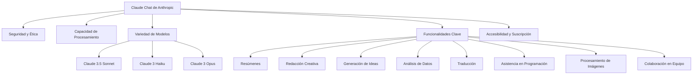
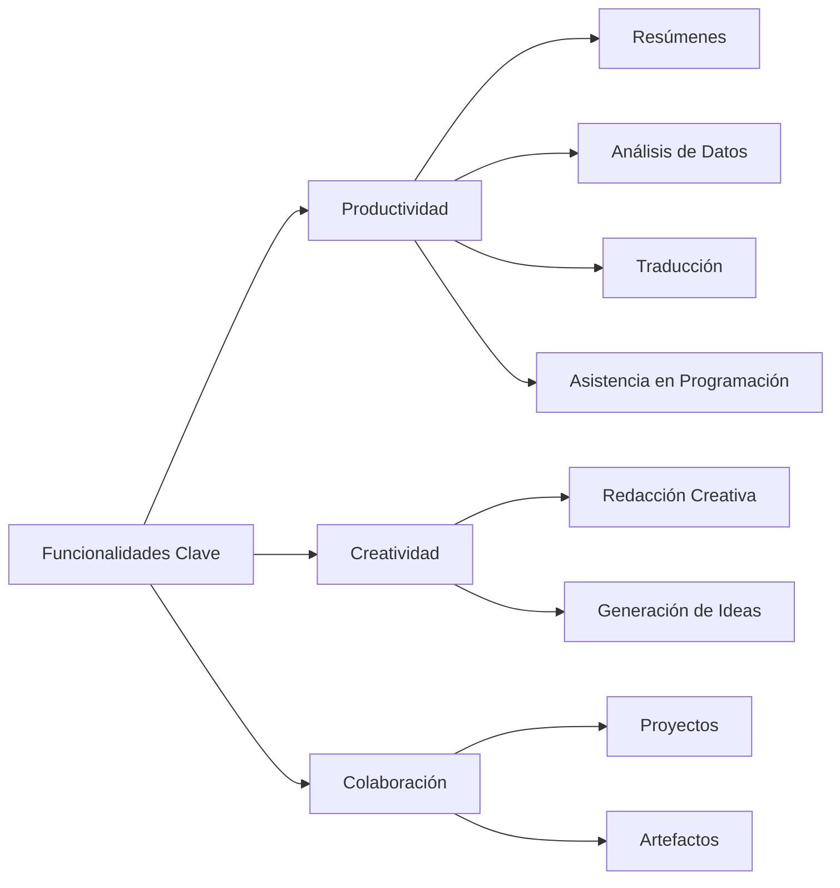

> [!blue] **Definición de Claude Chat**  
> Claude Chat es un **chatbot de IA** desarrollado por **Anthropic**, enfocado en la **seguridad** y **ética** mediante el uso de **"IA constitucional"**. Se entrena con **aprendizaje por refuerzo con retroalimentación humana (RLHF)**, utilizando grandes cantidades de datos de texto para predecir palabras de manera segura y contextual.

---

> [!yellow] **Características principales**  
> - **Seguridad y Ética**: Uso de IA constitucional y monitoreo continuo.  
> - **Capacidad de procesamiento**: Hasta **200,000 palabras** en una sola conversación.  
> - **Variedad de modelos**:  
>   - **Claude 3.5 Sonnet**: Potente e inteligente.  
>   - **Claude 3 Haiku**: Rápido y económico.  
>   - **Claude 3 Opus**: Para tareas complejas de alto rendimiento.  
> - **Análisis de imágenes**: Interpretación de fotos, gráficos y diagramas.  
> - **Generación de código**: Compatible con múltiples lenguajes de programación.  
> - **Procesamiento multilingüe**: Comprensión y generación de texto en varios idiomas.  
> - **Uso de herramientas externas**: Generación de código y descripción de imágenes para accesibilidad.

---

> [!green] **Elementos de la GUI**  
> - **Cuadro de entrada**: Para preguntas o mensajes.  
> - **Historial de conversaciones**: Acceso a conversaciones previas.  
> - **Soporte para archivos adjuntos**: Análisis de **PDF** y documentos de texto.  
> - **Opciones de personalización**: Ajuste mediante **prompts de sistema**.  
> - **Control de temperatura**: Configura la **creatividad** de las respuestas.  
> - **Modo oscuro/claro**: Cambio de tema visual para comodidad.

---

> [!purple] **Funcionalidades clave**  
> - **Resúmenes**: Hasta **150 páginas** en documentos largos.  
> - **Redacción creativa**: Creación de contenido (poemas, guiones, correos, etc.).  
> - **Generación de ideas**: Para proyectos y soluciones a problemas.  
> - **Análisis de datos**: Compatible con **hojas de cálculo** y **bases de datos**.  
> - **Traducción**: Entre varios idiomas.  
> - **Asistencia en programación**: Incluye **generación**, **depuración** y **explicación de código**.  
> - **Procesamiento de imágenes**: Descripción para accesibilidad visual y extracción de datos.  
> - **Colaboración en equipo**:  
>   - **Proyectos**: Organización en **espacios de trabajo compartidos**.  
>   - **Artefactos**: Generación de contenido (código, gráficos, documentos).

---

> [!orange] **Accesibilidad y Opciones de Suscripción**  
> - **Versión gratuita**: Acceso a **Claude 3.5 Sonnet** con funciones básicas.  
> - **Claude Pro**: $20/mes, más uso y acceso a **Claude 3 Opus**.  
> - **Claude Team**: $30/persona/mes, colaboración avanzada (mínimo 5 miembros).  
> - **Claude Enterprise**: Funciones avanzadas, **SSO** y **fuentes de datos**.  
> - **Precios de la API**:  
>   - **Claude Instant**: $0.0008 por 1000 tokens (entrada) y $0.0024 (salida).  
>   - **Claude 3.5 Sonnet**: $0.003 (entrada) y $0.015 (salida).  
>   - **Claude 3 Opus**: $0.015 (entrada) y $0.075 (salida).  
>   - **Claude 3 Haiku**: $0.00025 (entrada) y $0.00125 (salida).  

---

## Referencias y recursos

1. What Is Claude AI? | Built In, fecha de acceso: febrero 24, 2025, [https://builtin.com/articles/claude-ai](https://builtin.com/articles/claude-ai)

2. What is Claude AI, and how does it compare to ChatGPT? - Pluralsight, fecha de acceso: febrero 24, 2025, [https://www.pluralsight.com/resources/blog/ai-and-data/what-is-claude-ai](https://www.pluralsight.com/resources/blog/ai-and-data/what-is-claude-ai)

3. Intro to Claude - Anthropic API, fecha de acceso: febrero 24, 2025, [https://docs.anthropic.com/en/docs/intro-to-claude](https://docs.anthropic.com/en/docs/intro-to-claude)

4. Claude 3.5: A guide to Anthropic's AI models and chatbot - Zapier, fecha de acceso: febrero 24, 2025, [https://zapier.com/blog/claude-ai/](https://zapier.com/blog/claude-ai/)

5. Claude AI 101: What It Is and How It Works - Grammarly, fecha de acceso: febrero 24, 2025, [https://www.grammarly.com/blog/ai/what-is-claude-ai/](https://www.grammarly.com/blog/ai/what-is-claude-ai/)

6. Anthropic Claude: Features Benchmarks Versions API Tutorial - Acorn Labs, fecha de acceso: febrero 24, 2025, [https://www.acorn.io/resources/learning-center/anthropic-claude/](https://www.acorn.io/resources/learning-center/anthropic-claude/)

7. Bard vs ChatGPT vs Claude: Which is the best AI Assistant in 2024? - Fliki, fecha de acceso: febrero 24, 2025, [https://fliki.ai/blog/bard-vs-chatgpt-vs-claude](https://fliki.ai/blog/bard-vs-chatgpt-vs-claude)

8. Comparing ChatGPT, Bard, Claude, Gemini: LLMs | Medium, fecha de acceso: febrero 24, 2025, [https://medium.com/@DigitalQuill.ai/comparative-analysis-between-chatgpt-bard-claude-and-gemini-ai-llms-30b7a4488c5d](https://medium.com/@DigitalQuill.ai/comparative-analysis-between-chatgpt-bard-claude-and-gemini-ai-llms-30b7a4488c5d)

9. An In-depth Comparison: ChatGPT vs. Claude vs. Bard | Winston AI, fecha de acceso: febrero 24, 2025, [https://gowinston.ai/an-in-depth-comparison-chatgpt-vs-claude-vs-bard/](https://gowinston.ai/an-in-depth-comparison-chatgpt-vs-claude-vs-bard/)

10. chihebnabil/claude-ui: A modern chat interface for Anthropic's Claude AI models built with Nuxt.js. Experience seamless conversations with Claude in a clean user interface. - GitHub, fecha de acceso: febrero 24, 2025, [https://github.com/chihebnabil/claude-ui](https://github.com/chihebnabil/claude-ui)

11. Claude, fecha de acceso: febrero 24, 2025, [https://claude.ai/](https://claude.ai/)

12. What Chat Interface are you using with Claude? : r/ClaudeAI - Reddit, fecha de acceso: febrero 24, 2025, [https://www.reddit.com/r/ClaudeAI/comments/1hn1rub/what_chat_interface_are_you_using_with_claude/](https://www.reddit.com/r/ClaudeAI/comments/1hn1rub/what_chat_interface_are_you_using_with_claude/)

13. I Built a Claude Chat UI Because I Was Tired of the Official Limitations | Codementor, fecha de acceso: febrero 24, 2025, [https://www.codementor.io/@chihebnabil/i-built-a-claude-chat-ui-because-i-was-tired-of-the-official-limitations-2lxqr345lk](https://www.codementor.io/@chihebnabil/i-built-a-claude-chat-ui-because-i-was-tired-of-the-official-limitations-2lxqr345lk)

14. Claude “Computer Use” Demo - Here's What Nobody's Telling You! - YouTube, fecha de acceso: febrero 24, 2025, [https://www.youtube.com/watch?v=W4l0eIOVQ9E](https://www.youtube.com/watch?v=W4l0eIOVQ9E)

15. A Quick Chat With Claude 3.5 Sonnet - YouTube, fecha de acceso: febrero 24, 2025, [https://www.youtube.com/watch?v=lDZsZriCwoY](https://www.youtube.com/watch?v=lDZsZriCwoY)

16. How to use Claude: Anthropic's AI Chatbot! #87 - YouTube, fecha de acceso: febrero 24, 2025, [https://www.youtube.com/watch?v=VIJQT9HsbCo](https://www.youtube.com/watch?v=VIJQT9HsbCo)

17. www.pluralsight.com, fecha de acceso: febrero 24, 2025, [https://www.pluralsight.com/resources/blog/ai-and-data/what-is-claude-ai#:~:text=Claude%2C%20developed%20by%20Anthropic%20AI,code%2Dwriting%2C%20and%20more.](https://www.pluralsight.com/resources/blog/ai-and-data/what-is-claude-ai#:~:text=Claude%2C%20developed%20by%20Anthropic%20AI,code%2Dwriting%2C%20and%20more.)

18. How to Use Claude AI Full Guide (2024) - Jamie AI, fecha de acceso: febrero 24, 2025, [https://www.meetjamie.ai/blog/how-to-use-claude](https://www.meetjamie.ai/blog/how-to-use-claude)

19. How Entrepreneurs Can Use Claude to Boost Productivity - Medium, fecha de acceso: febrero 24, 2025, [https://medium.com/the-ai-entrepreneurs/how-entrepreneurs-can-use-claude-to-boost-productivity-ebecef1098c3](https://medium.com/the-ai-entrepreneurs/how-entrepreneurs-can-use-claude-to-boost-productivity-ebecef1098c3)

20. Claude for Teams: What You Need to Know - Section School, fecha de acceso: febrero 24, 2025, [https://www.sectionschool.com/blog/claude-for-teams](https://www.sectionschool.com/blog/claude-for-teams)

21. Team up with Claude - Anthropic, fecha de acceso: febrero 24, 2025, [https://www.anthropic.com/team](https://www.anthropic.com/team)

22. Collaborate with Claude on Projects - Anthropic, fecha de acceso: febrero 24, 2025, [https://www.anthropic.com/news/projects](https://www.anthropic.com/news/projects)

23. How To Get the Most out of Claude AI - DreamHost, fecha de acceso: febrero 24, 2025, [https://www.dreamhost.com/blog/claude-ai/](https://www.dreamhost.com/blog/claude-ai/)

24. Anthropic Claude AI: Pricing and Features - Latenode, fecha de acceso: febrero 24, 2025, [https://latenode.com/blog/claude-ai-pricing-and-features](https://latenode.com/blog/claude-ai-pricing-and-features)