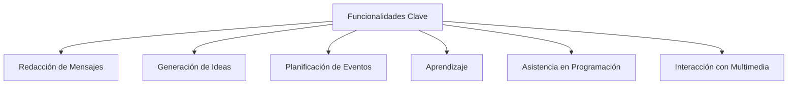
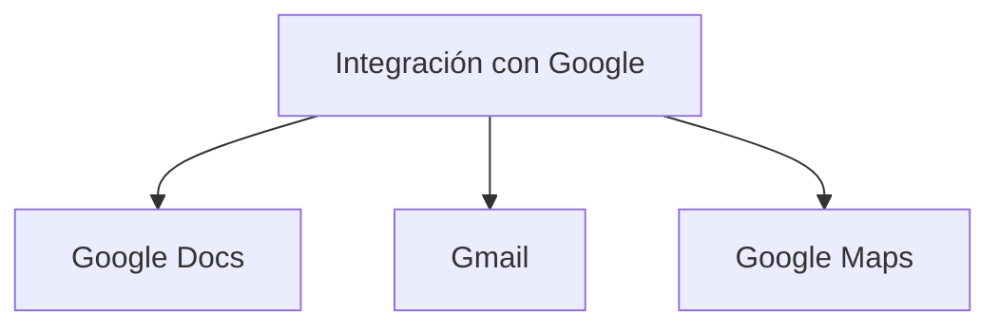
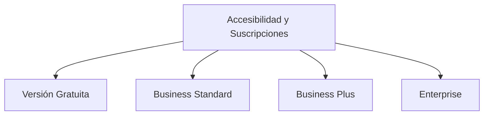

> [!gen] **¿Qué es Google Gemini Chat?**  
> Google Gemini Chat es un chatbot de inteligencia artificial generativa desarrollado por Google como evolución de Bard. Se basa en la familia de modelos de lenguaje grandes (LLM) llamados **Gemini**, los cuales permiten comprender y generar texto, imágenes, audio, video y código de forma nativa. Se lanzó en 2023 y está diseñado para asistir en tareas como escritura, planificación, aprendizaje y asistencia en programación.

---

> [!gen] **Características principales**  
> - **Capacidades multimodales**: Procesa información de texto, imágenes, audio y video, permitiendo interacciones más naturales e intuitivas.
> - **Integración con servicios de Google**: Funciona con Gmail, Google Docs, Google Maps y Google Flights, optimizando flujos de trabajo sin salir de la interfaz del chatbot.
> - **Respuestas informativas y creativas**: Proporciona respuestas detalladas incluso a preguntas abiertas o inusuales.
> - **Variantes optimizadas**: Incluye **Gemini Nano** para móviles (funciona sin conexión) y **Gemini Ultra** para análisis avanzado.
> - **Personalización**: Permite elegir diferentes voces para respuestas verbales.

```mermaid
flowchart TD
    A[Google Gemini Chat] --> B[Capacidades Multimodales]
    A --> C[Integración con Servicios de Google]
    A --> D[Respuestas Informativas]
    A --> E[Variantes Optimizadas]
    A --> F[Personalización]
````

---

> [!funcion] **Elementos de la interfaz de usuario**
> ![[Gemini_web_app.png]]
> - **Acceso**: Disponible en **Google Messages** y en la aplicación móvil dedicada a **Gemini**.
> - **Interfaz simple e intuitiva**: Incluye un área de conversación con opciones para adjuntar archivos (imágenes, documentos).
> - **Gemini Live**: Ofrece conversaciones fluidas mediante comandos de voz, permitiendo interrupciones y cambios de tema como en una conversación humana.

```mermaid
flowchart TD
    UI[Interfaz de Usuario] --> |Acceso| A[Google Messages]
    UI --> |Acceso| B[App Móvil de Gemini]
    UI --> C[Área de Conversación]
    UI --> D[Gemini Live]
```

---

> [!funcion] **Funcionalidades clave**
> 
> - **Redacción de mensajes**: Ayuda a crear correos electrónicos, textos y publicaciones en redes sociales adaptándose al tono deseado.
> - **Generación de ideas**: Soporte para lluvia de ideas y resolución creativa de problemas.
> - **Planificación de eventos**: Asiste en la organización de reuniones, viajes o fiestas.
> - **Aprendizaje**: Explica conceptos complejos y proporciona recursos adicionales.
> - **Asistencia en programación**: Genera código en diversos lenguajes y soluciona errores.
> - **Interacción con contenido multimedia**: Analiza imágenes, extrae información de PDFs y responde a preguntas sobre videos de YouTube.



---

> [!incl] **Integración con otras herramientas de Google**  
> Gemini está integrado en **Google Workspace** (Google Docs, Gmail) y en **Google Maps**, permitiendo:
> 
> - **Google Docs**: Asistencia en redacción y edición.
> - **Gmail**: Redacción de correos, sugerencias de respuestas y búsqueda de información.
> - **Google Maps**: Resúmenes contextualizados de lugares y áreas.



---

> [!incl] **Accesibilidad y opciones de suscripción**
> 
> - Disponible en **más de 165 países** y en varios idiomas.
> - **Versión gratuita** con funciones básicas (generación de texto, traducción, información).
> - **Opciones de suscripción en Google Workspace**:
>     - **Business Standard** ($12 USD/usuario/mes): Incluye Gemini en Gmail y Docs, 2 TB de almacenamiento y reuniones para hasta 150 personas.
>     - **Business Plus** ($18 USD/usuario/mes): Incluye funcionalidades avanzadas como eDiscovery, Vault y reuniones de hasta 250 personas.
>     - **Enterprise**: Funciones avanzadas de seguridad y cumplimiento (precio a consultar).



---

## Referencias y recursos

1. zapier.com, fecha de acceso: febrero 24, 2025, [https://zapier.com/blog/google-gemini/#:~:text=Google%20Gemini%20is%20a%20family,audio%2C%20videos%2C%20and%20code.](https://zapier.com/blog/google-gemini/#:~:text=Google%20Gemini%20is%20a%20family,audio%2C%20videos%2C%20and%20code.)

2. What is Google Gemini? What you need to know - Zapier, fecha de acceso: febrero 24, 2025, [https://zapier.com/blog/google-gemini/](https://zapier.com/blog/google-gemini/)

3. en.wikipedia.org, fecha de acceso: febrero 24, 2025, [https://en.wikipedia.org/wiki/Gemini_(chatbot)#:~:text=Gemini%2C%20formerly%20known%20as%20Bard,the%20LaMDA%20and%20PaLM%20LLMs.](https://en.wikipedia.org/wiki/Gemini_\(chatbot\)#:~:text=Gemini%2C%20formerly%20known%20as%20Bard,the%20LaMDA%20and%20PaLM%20LLMs.)

4. Gemini (chatbot) - Wikipedia, fecha de acceso: febrero 24, 2025, [https://en.wikipedia.org/wiki/Gemini_(chatbot)](https://en.wikipedia.org/wiki/Gemini_\(chatbot\))

5. ‎What Gemini Apps can do and other frequently asked questions, fecha de acceso: febrero 24, 2025, [https://gemini.google.com/faq](https://gemini.google.com/faq)

6. Google Gemini - Apps on Google Play, fecha de acceso: febrero 24, 2025, [https://play.google.com/store/apps/details?id=com.google.android.apps.bard](https://play.google.com/store/apps/details?id=com.google.android.apps.bard)

7. Gemini AI is coming to Google Messages: Here's how to use it - GeeksforGeeks, fecha de acceso: febrero 24, 2025, [https://www.geeksforgeeks.org/gemini-now-integrated-into-googles-messages-app/](https://www.geeksforgeeks.org/gemini-now-integrated-into-googles-messages-app/)

8. What is Google Gemini? | IBM, fecha de acceso: febrero 24, 2025, [https://www.ibm.com/think/topics/google-gemini](https://www.ibm.com/think/topics/google-gemini)

9. Talk naturally with Gemini Live - Android - Google Help, fecha de acceso: febrero 24, 2025, [https://support.google.com/gemini/answer/15274899?hl=en&co=GENIE.Platform%3DAndroid](https://support.google.com/gemini/answer/15274899?hl=en&co=GENIE.Platform%3DAndroid)

10. Use Gemini in Google Messages - Gemini Apps Help, fecha de acceso: febrero 24, 2025, [https://support.google.com/gemini/answer/14599070?hl=en](https://support.google.com/gemini/answer/14599070?hl=en)

11. AI Tools for Business | Google Workspace, fecha de acceso: febrero 24, 2025, [https://workspace.google.com/solutions/ai/](https://workspace.google.com/solutions/ai/)