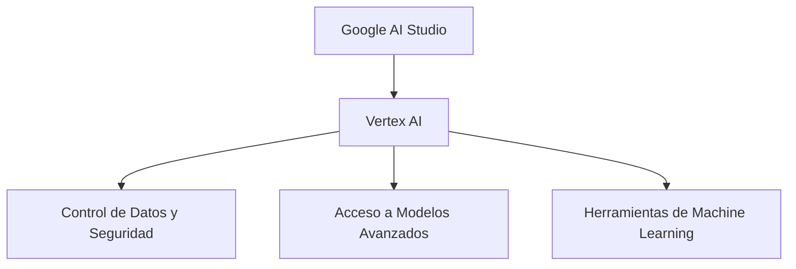

# Google AI Studio

> [!gen] **¿Qué es Google AI Studio?**  
> Google AI Studio es un **entorno de desarrollo integrado (IDE)** basado en navegador, diseñado específicamente para la **creación de prototipos y experimentación** con modelos de IA generativa. Facilita el desarrollo de aplicaciones impulsadas por IA a través de **prompts en lenguaje natural**, permitiendo exportar prototipos a código funcional utilizando la **API de Gemini**.

---

## Características Principales

> [!funcion]  **Características**
> - **Creación rápida de prototipos**: IDE basado en navegador para experimentar y exportar código usando la API de Gemini.
> - **Prompts multimodales**: Soporte para prompts de texto e imágenes.
> - **Configuración de seguridad**: Control de contenido generado para garantizar privacidad y ética.
> - **Generación de claves API**: Fácil integración de modelos en aplicaciones.
> - **Selección de modelos**: Acceso a modelos como **Gemini (2.0 Pro, Flash, Flash-Lite), Imagen, Codey y Chirp**, además de modelos de código abierto.
> - **Ajuste de modelos**: Personalización avanzada con **aprendizaje por refuerzo** y **ajustes con datos propios**.
> - **Extensiones de Vertex AI**: Herramientas gestionadas para crear extensiones con datos en tiempo real.

---

## Elementos de la GUI

> [!blue] **Interfaz de Usuario**
> ![[Google_AI_Studio.png]]
> - **Página principal**: Acceso rápido a funciones como creación de prompts y gestión de claves API.
> - **Sección de prompts**: Experimentación con prompts de chat y prompts estructurados con parámetros ajustables.
> - **Ajuste de modelos**: Personalización de modelos con datos propios.
> - **Galería de prompts**: Plantillas listas para usar en proyectos como creadores de blogs y resúmenes.

```mermaid
flowchart TD
    A[Google AI Studio] --> B[Página principal]
    A --> C[Sección de prompts]
    A --> D[Ajuste de modelos]
    A --> E[Galería de prompts]
````

---

## Funcionalidades Clave

> [!green]
> 
> - **Generación de texto**: Contenido creativo para marketing, artículos y traducción de idiomas.
> - **Generación de código**: Asistencia en **programación, depuración y documentación**.
> - **Generación de imágenes**: Creación de imágenes de alta calidad a partir de descripciones de texto.
> - **Chatbots y asistentes virtuales**: Creación de asistentes con **personalidades personalizadas**.
> - **Análisis de datos**: Extracción de información valiosa de **texto, imágenes y audio**.

```mermaid
graph LR
    Texto[Generación de Texto] -->|Marketing| Aplicaciones
    Código[Generación de Código] -->|Depuración| Desarrolladores
    Imágenes[Generación de Imágenes] -->|Creatividad| Diseñadores
    Chatbots[Chatbots y Asistentes] -->|Interacción| Clientes
    Análisis[Análisis de Datos] -->|Insights| Empresas
```

---

## Integración con Vertex AI

> [!yellow] **Integración con Vertex AI**  
> Google AI Studio se integra con **Vertex AI** de Google Cloud, permitiendo escalar proyectos con **control total de datos, privacidad y seguridad avanzada**, además de acceso a más modelos y herramientas de **machine learning**.



---

## Accesibilidad y Planes

> [!orange] **Accesibilidad y Planes**
> 
> - **Nivel gratuito**: Ideal para **estudiantes, investigadores y desarrolladores independientes**, con acceso gratuito a funciones avanzadas.
> - **Planes de pago**: Con precios flexibles según el uso, incluyendo el **Google One AI Premium Plan** ($19.99/mes) que ofrece:
>     - **Gemini Advanced**: Modelos más capaces y acceso prioritario a nuevas funciones.
>     - **Ventana de contexto de 1 millón de tokens**.
>     - **2 TB de almacenamiento** en Google One.

---

## Referencias y recursos

1. Going for Gold with Google AI Studio - Suitebriar Blog, fecha de acceso: febrero 21, 2025, [https://blog.suitebriar.com/going-for-gold-with-google-ai-studio](https://blog.suitebriar.com/going-for-gold-with-google-ai-studio)

2. Vertex AI Studio | Google Cloud, fecha de acceso: febrero 21, 2025, [https://cloud.google.com/generative-ai-studio](https://cloud.google.com/generative-ai-studio)

3. What is Google AI Studio? - Klu.ai, fecha de acceso: febrero 21, 2025, [https://klu.ai/glossary/google-ai-studio](https://klu.ai/glossary/google-ai-studio)

4. Gemini 2.0 model updates: 2.0 Flash, Flash-Lite, Pro Experimental - The Keyword, fecha de acceso: febrero 21, 2025, [https://blog.google/technology/google-deepmind/gemini-model-updates-february-2025/](https://blog.google/technology/google-deepmind/gemini-model-updates-february-2025/)

5. Google AI Studio for Beginners: A Step-by-Step Guide - Neuroflash, fecha de acceso: febrero 21, 2025, [https://neuroflash.com/blog/google-ai-studio/](https://neuroflash.com/blog/google-ai-studio/)

6. Google AI Studio, fecha de acceso: febrero 21, 2025, [https://aistudio.google.com/](https://aistudio.google.com/)

7. Google AI Studio quickstart - Gemini API, fecha de acceso: febrero 21, 2025, [https://ai.google.dev/gemini-api/docs/ai-studio-quickstart](https://ai.google.dev/gemini-api/docs/ai-studio-quickstart)

8. Google AI Studio Guide: Tips & Best Practices - Institute of Ai Studies, fecha de acceso: febrero 21, 2025, [https://www.instituteofaistudies.com/insights/how-to-use-google-ai-studio-for-beginners](https://www.instituteofaistudies.com/insights/how-to-use-google-ai-studio-for-beginners)

9. Experience AI in our products and experimental tools - Google AI, fecha de acceso: febrero 21, 2025, [https://ai.google/get-started/products/](https://ai.google/get-started/products/)

10. Google One AI Premium Plan and Features, fecha de acceso: febrero 21, 2025, [https://one.google.com/about/ai-premium/](https://one.google.com/about/ai-premium/)

11. Get Google One AI Premium benefits - Computer, fecha de acceso: febrero 21, 2025, [https://support.google.com/googleone/answer/14534406?hl=en_ZA&co=GENIE.Platform%3DDesktop](https://support.google.com/googleone/answer/14534406?hl=en_ZA&co=GENIE.Platform%3DDesktop)

12. AI Tools for Business - Google Workspace, fecha de acceso: febrero 21, 2025, [https://workspace.google.com/solutions/ai/](https://workspace.google.com/solutions/ai/)

13. Can somebody explain Google AI Studio for me? : r/Bard - Reddit, fecha de acceso: febrero 21, 2025, [https://www.reddit.com/r/Bard/comments/1hrre1v/can_somebody_explain_google_ai_studio_for_me/](https://www.reddit.com/r/Bard/comments/1hrre1v/can_somebody_explain_google_ai_studio_for_me/)

14. Exploring the Power of Google AI Studio: A Comprehensive Guide tutorial - Lablab.ai, fecha de acceso: febrero 21, 2025, [https://lablab.ai/t/google-ai-studio](https://lablab.ai/t/google-ai-studio)

15. google ai studio is amazing, but anyone else struggling with the speed? (especially with large chats) : r/Bard - Reddit, fecha de acceso: febrero 21, 2025, [https://www.reddit.com/r/Bard/comments/1hw6qx4/google_ai_studio_is_amazing_but_anyone_else/](https://www.reddit.com/r/Bard/comments/1hw6qx4/google_ai_studio_is_amazing_but_anyone_else/)

16. Google AI Studio Overview & SaaS Benefits - baseTOP, fecha de acceso: febrero 21, 2025, [https://basetop.ca/blog/Google%20AI-Studio-Overview-&-SaaS-Benefits](https://basetop.ca/blog/Google%20AI-Studio-Overview-&-SaaS-Benefits)