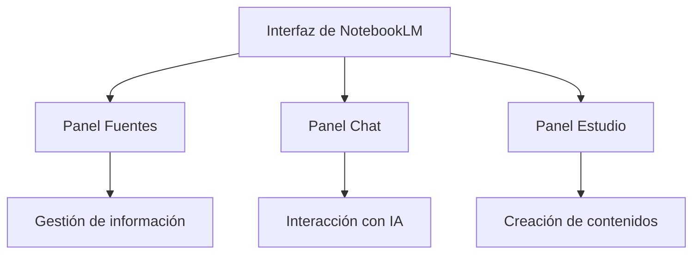
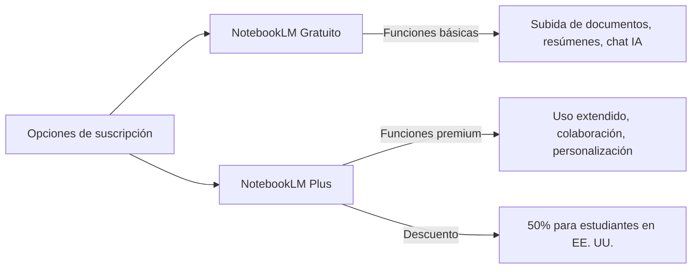

## ¿Qué es NotebookLM?  

> [!blue] **Definición**  
> NotebookLM es una herramienta de investigación y toma de notas desarrollada por Google Labs que utiliza inteligencia artificial para permitir a los usuarios interactuar con sus documentos de manera más eficiente.  
> Funciona como un asistente de investigación virtual que se adapta a las notas y fuentes proporcionadas por el usuario, creando una IA personalizada que ayuda a leer, tomar notas y organizar ideas.  
> Utiliza la arquitectura **Gemini 1.5** de Google, permitiendo procesar contenido multimodal como PDF, documentos de Google, videos de YouTube y más.  

---

## Características principales  

> [!green] **Características destacadas**  
> - **Importación versátil de documentos**: Admite formatos de Google Drive, PDF, texto, URLs, videos de YouTube y audio.  
> - **Creación y refinamiento de contenido**: Genera resúmenes, líneas de tiempo, preguntas frecuentes, documentos informativos y guías de estudio.  
> - **Colaboración interactiva**: Permite preguntas directas a la IA con respuestas citadas para verificación.  
> - **Herramientas de escritura y notas**: Incluye sugerencias inteligentes, combinación de notas y estilo personalizado.  
> - **Resúmenes de audio**: Genera resúmenes en formato podcast con voces de IA y un "Modo Interactivo" para interactuar en tiempo real.  
> - **Formato estructurado**: Crea tablas de contenido, cronogramas y documentos organizados.  
> - **Capacidad multimodal**: Procesa texto, imágenes, audio y video.  
> - **Reducción de alucinaciones**: Basada en fuentes proporcionadas, minimizando información incorrecta.  
> - **Mejora de retención de información**: Presenta información en fragmentos digeribles para facilitar el aprendizaje.  

---

## Elementos de la interfaz de usuario  

> [!yellow] **Interfaz de usuario**  
> La interfaz de **NotebookLM** está organizada en tres paneles principales:  
> ![[NotebookLM.png]]
> - **Panel "Fuentes"**: Para gestionar la información del proyecto, incluyendo subida, eliminación y organización de fuentes.  
> - **Panel "Chat"**: Interfaz conversacional de IA para preguntas, resúmenes y generación de ideas.  
> - **Panel "Estudio"**: Crea contenidos como guías de estudio, documentos informativos y resúmenes de audio.  

---

## Accesibilidad y opciones de suscripción

> [!orange] **Accesibilidad y suscripciones**
> 
> - **NotebookLM (gratuito)**:
>     - Funcionalidades básicas: subida de documentos, generación de resúmenes e interacción con IA.
>     - Disponible para usuarios con cuenta de Google mayores de 18 años en más de 200 regiones.
> - **NotebookLM Plus (de pago)**:
>     - Incluye límites de uso 5 veces mayores, personalización de respuestas, opciones de colaboración y compartir notebooks.
>     - Disponible con la suscripción a **Google One AI Premium** por **$19.99/mes**.
>     - **Descuento para estudiantes**: En EE. UU., 50% de descuento durante 12 meses, precio reducido a **$9.99/mes**.

## Referencias y recursos:

1. NotebookLM - Wikipedia, fecha de acceso: febrero 22, 2025, [https://en.wikipedia.org/wiki/NotebookLM](https://en.wikipedia.org/wiki/NotebookLM)

2. NotebookLM: How to try Google's experimental AI-first notebook - The Keyword, fecha de acceso: febrero 22, 2025, [https://blog.google/technology/ai/notebooklm-google-ai/](https://blog.google/technology/ai/notebooklm-google-ai/)

3. Get started with NotebookLM and NotebookLM Plus - Google Help, fecha de acceso: febrero 22, 2025, [https://support.google.com/notebooklm/answer/15724458?hl=en](https://support.google.com/notebooklm/answer/15724458?hl=en)

4. 3 Things You Need to Know about Google's New NotebookLM | by Fru - Medium, fecha de acceso: febrero 22, 2025, [https://medium.com/@frulouis/googles-new-notebooklm-here-s-what-you-need-to-know-4411c3f5cd0c](https://medium.com/@frulouis/googles-new-notebooklm-here-s-what-you-need-to-know-4411c3f5cd0c)

5. A Complete How-To Guide to NotebookLM - Learn Prompting, fecha de acceso: febrero 22, 2025, [https://learnprompting.org/blog/notebooklm-guide](https://learnprompting.org/blog/notebooklm-guide)

6. NotebookLM Plus is now available in the Google One AI Premium subscription., fecha de acceso: febrero 22, 2025, [https://blog.google/feed/notebooklm-google-one/](https://blog.google/feed/notebooklm-google-one/)

7. NotebookLM: A Guide With Practical Examples - DataCamp, fecha de acceso: febrero 22, 2025, [https://www.datacamp.com/tutorial/notebooklm](https://www.datacamp.com/tutorial/notebooklm)

8. NotebookLM - XCITE Center for Teaching and Learning | - University of California, Riverside, fecha de acceso: febrero 22, 2025, [https://teaching.ucr.edu/notebooklm](https://teaching.ucr.edu/notebooklm)

9. Everything You Need to Know About Google's NotebookLM, fecha de acceso: febrero 22, 2025, [https://blog.commlabindia.com/elearning-design/google-notebook-lm-beginner-guide](https://blog.commlabindia.com/elearning-design/google-notebook-lm-beginner-guide)

10. NotebookLM gets a new look, audio interactivity and a premium version, fecha de acceso: febrero 22, 2025, [https://blog.google/technology/google-labs/notebooklm-new-features-december-2024/](https://blog.google/technology/google-labs/notebooklm-new-features-december-2024/)

11. Why Google's NotebookLM Is A Killer App For Small Business | by Gene Marks - Medium, fecha de acceso: febrero 22, 2025, [https://genemarks.medium.com/why-googles-notebooklm-is-a-killer-app-for-small-business-72e5e6ce8cce](https://genemarks.medium.com/why-googles-notebooklm-is-a-killer-app-for-small-business-72e5e6ce8cce)

12. 8 expert tips for getting started with NotebookLM - The Keyword, fecha de acceso: febrero 22, 2025, [https://blog.google/technology/ai/notebooklm-beginner-tips/](https://blog.google/technology/ai/notebooklm-beginner-tips/)

13. Google One AI Premium adds popular NotebookLM Plus - at no extra charge - ZDNET, fecha de acceso: febrero 22, 2025, [https://www.zdnet.com/article/google-one-ai-premium-adds-popular-notebooklm-plus-at-no-extra-charge/](https://www.zdnet.com/article/google-one-ai-premium-adds-popular-notebooklm-plus-at-no-extra-charge/)

14. NotebookLM Plus now available with the Google One AI Premium subscription plan, fecha de acceso: febrero 22, 2025, [https://www.tomsguide.com/ai/notebooklm-plus-now-available-with-the-google-one-ai-premium-subscription-plan](https://www.tomsguide.com/ai/notebooklm-plus-now-available-with-the-google-one-ai-premium-subscription-plan)