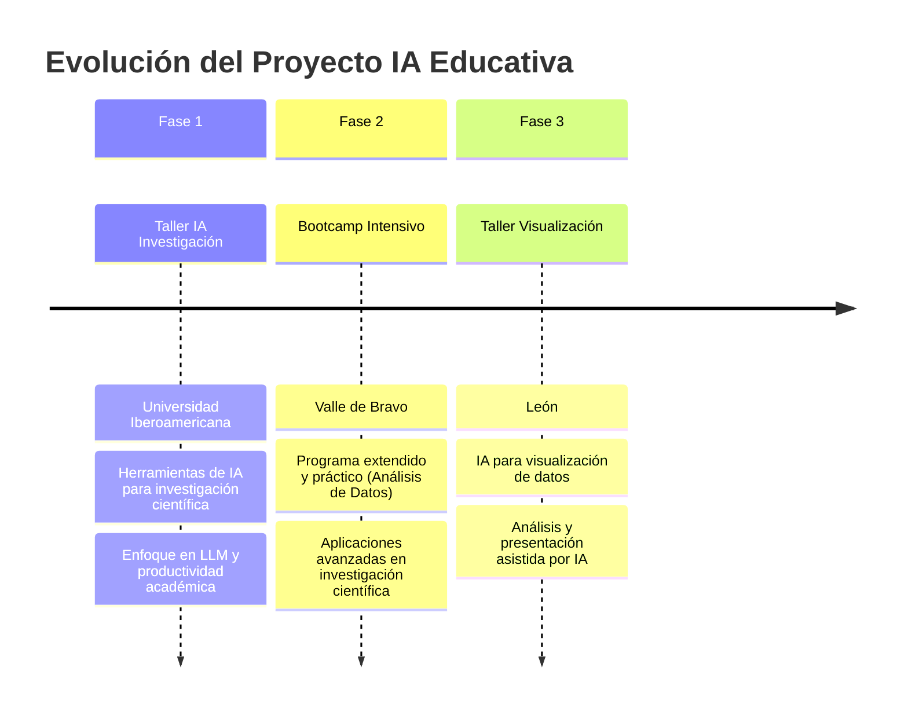

# 🤖 Inteligencia Artificial para Investigación y Docencia
### *Talleres, Bootcamps y Herramientas Prácticas*

 

---

## 🎯 Acerca del Proyecto

> [!NOTE]
> **Evolución del Proyecto de IA Educativa**
> 
> Este repositorio documenta una serie de iniciativas educativas sobre **Inteligencia Artificial** desarrolladas para la **Universidad Iberoamericana**, evolucionando desde talleres especializados hasta bootcamps completos.

---

## 📚 Contenido del Repositorio

<table>
<tr>
<th>🗂️ Módulo</th>
<th>📍 Ubicación</th>
<th>📝 Descripción</th>
<th>🎯 Audiencia</th>
</tr>
<tr>
<td><strong>Taller IA Investigación</strong></td>
<td><code>01_Taller_IA_Investigacion/</code></td>
<td>Introducción a LLM para investigación académica</td>
<td>Investigadores y docentes</td>
</tr>
<tr>
<td><strong>Bootcamp IA</strong></td>
<td><code>02_Bootcamp_IA_Investigacion/</code></td>
<td>Programa intensivo con aplicaciones prácticas sobre Análisis de Datos asistido por IA</td>
<td>Comunidad académica avanzada</td>
</tr>
<tr>
<td><strong>Visualización IA</strong></td>
<td><code>03_Visualizacion_IA/</code></td>
<td>IA para análisis y visualización de datos</td>
<td>Analistas y investigadores de datos</td>
</tr>
<tr>
<td><strong>Assets</strong></td>
<td><code>00_Assets/</code></td>
<td>Recursos gráficos</td>
<td></td>
</tr>
</table>

---

## 🛠️ Herramientas y Plataformas

> [!IMPORTANT]
> **Plataformas Principales Utilizadas**

---

## 📋 Requisitos Previos

> [!WARNING]
> **Requisitos Técnicos**

### 💻 **Hardware**
- Laptop con conexión estable a internet
- Navegador web actualizado (Chrome, Firefox, Safari, Edge)
- Cuenta de Google (recomendado para herramientas de Google AI)

### 🧠 **Conocimientos**
- **Básico:** Familiaridad con navegación web
- **Intermedio:** Conocimientos de investigación académica
- **Avanzado:** Experiencia en análisis de datos (para módulo de visualización)

---

## 👥 Equipo Académico

| 👨‍🏫 **Instructor** | 📧 **Contacto** | 🎯 **Especialidad** |
|:---:|:---:|:---:|
| **Wilfrido A. Gómez-Arias** | wilfrido.gomez@ibero.mx | IA en Investigación Social |
| **Juan Vázquez** | - | Desarrollador web|
| **Armando Huitzilt Rodríguez** | arhuitzilt@gmail.com | Investigador y desarrollador de herramientas de IA |

---

## 📞 Contacto e Información

> [!NOTE]
> **Canales Oficiales**

### 🏛️ **Institucional**
- **📧 Email:** [socialdata@ibero.mx](mailto:socialdata@ibero.mx)
- **🌐 Web:** [Social Data IBERO](https://socialdata.ibero.mx/)

### 📚 **Recursos Adicionales**
- **📖 EducaIA:** [Manual Interactivo](https://socialdataibero.github.io/educaIA/intro.html)
- **📊 Presentaciones:** Disponibles en cada módulo y dentro de cada carpeta de talleres.

---

## 📄 Licencia

> [!NOTE]
> Este proyecto está bajo la Licencia MIT. Ver el archivo `LICENSE` para más detalles.

---

### 🎓 *Universidad Iberoamericana*

---

*Última actualización: Junio 2025*

